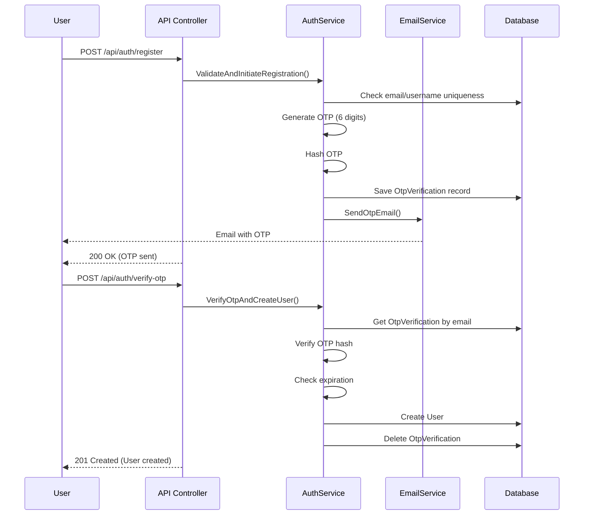

# Design Document: User Registration with OTP Verification

## Overview

Hệ thống đăng ký người dùng với xác thực OTP qua email. Flow chính gồm 3 bước: submit registration → verify OTP → create account. Sử dụng Gmail SMTP để gửi email và lưu OTP đã hash trong database.

## Architecture



## Components and Interfaces

### Domain Layer (CodeNexus.Domain)

```csharp
// Entities/OtpVerification.cs
public class OtpVerification
{
    public Guid Id { get; set; }
    public string Email { get; set; }
    public string Username { get; set; }
    public string PasswordHash { get; set; }
    public string OtpHash { get; set; }
    public DateTime ExpiresAt { get; set; }
    public int AttemptCount { get; set; }
    public int ResendCount { get; set; }
    public DateTime? LastResendAt { get; set; }
    public DateTime CreatedAt { get; set; }
}
```

### Application Layer (CodeNexus.Application)

```csharp
// Interfaces/IAuthService.cs
public interface IAuthService
{
    Task<Result> InitiateRegistrationAsync(RegisterRequest request);
    Task<Result<UserResponse>> VerifyOtpAsync(VerifyOtpRequest request);
    Task<Result> ResendOtpAsync(ResendOtpRequest request);
}

// Interfaces/IEmailService.cs
public interface IEmailService
{
    Task SendOtpEmailAsync(string email, string otp);
}

// DTOs/RegisterRequest.cs
public record RegisterRequest(string Email, string Username, string Password);

// DTOs/VerifyOtpRequest.cs
public record VerifyOtpRequest(string Email, string Otp);

// DTOs/ResendOtpRequest.cs
public record ResendOtpRequest(string Email);
```

### Infrastructure Layer (CodeNexus.Infrastructure)

```csharp
// Services/AuthService.cs - Implementation of IAuthService
// Services/EmailService.cs - Gmail SMTP implementation
// Repositories/OtpVerificationRepository.cs
```

### API Layer (CodeNexus.API)

```csharp
// Controllers/AuthController.cs
[ApiController]
[Route("api/[controller]")]
public class AuthController : ControllerBase
{
    [HttpPost("register")]
    public async Task<IActionResult> Register(RegisterRequest request);

    [HttpPost("verify-otp")]
    public async Task<IActionResult> VerifyOtp(VerifyOtpRequest request);

    [HttpPost("resend-otp")]
    public async Task<IActionResult> ResendOtp(ResendOtpRequest request);
}
```

## Data Models

### OtpVerification Table

| Column | Type | Description |
|--------|------|-------------|
| Id | GUID | Primary key |
| Email | nvarchar(256) | User email (unique index) |
| Username | nvarchar(50) | Desired username |
| PasswordHash | nvarchar(256) | Hashed password |
| OtpHash | nvarchar(256) | Hashed OTP |
| ExpiresAt | datetime2 | OTP expiration time |
| AttemptCount | int | Failed verification attempts |
| ResendCount | int | Number of resend requests |
| LastResendAt | datetime2 | Last resend timestamp |
| CreatedAt | datetime2 | Record creation time |

## Correctness Properties

*A property is a characteristic or behavior that should hold true across all valid executions of a system-essentially, a formal statement about what the system should do. Properties serve as the bridge between human-readable specifications and machine-verifiable correctness guarantees.*

### Property 1: Invalid email format rejection
*For any* string that does not match email format (regex: ^[^@\s]+@[^@\s]+\.[^@\s]+$), the registration SHALL be rejected with validation error.
**Validates: Requirements 1.2**

### Property 2: Password complexity validation
*For any* password that does not contain at least 8 characters, 1 uppercase, 1 lowercase, and 1 number, the registration SHALL be rejected with validation error.
**Validates: Requirements 1.5**

### Property 3: OTP generation format
*For any* valid registration request, the generated OTP SHALL be exactly 6 numeric digits.
**Validates: Requirements 2.1**

### Property 4: OTP storage security
*For any* generated OTP, the stored value in database SHALL NOT equal the plaintext OTP (must be hashed).
**Validates: Requirements 2.2**

### Property 5: OTP expiration setting
*For any* generated OTP, the ExpiresAt timestamp SHALL be exactly 5 minutes after CreatedAt.
**Validates: Requirements 2.3**

### Property 6: Valid OTP verification creates user
*For any* valid OTP submitted within expiration time, the system SHALL create a user with matching email and username.
**Validates: Requirements 3.1**

### Property 7: Invalid OTP rejection
*For any* OTP that does not match the stored hash, verification SHALL be rejected.
**Validates: Requirements 3.2**

### Property 8: OTP cleanup after verification
*For any* successful OTP verification, the OtpVerification record SHALL be removed from database.
**Validates: Requirements 3.5, 5.2**

### Property 9: Previous OTP invalidation on resend
*For any* OTP resend request, the previous OTP for that email SHALL no longer be valid for verification.
**Validates: Requirements 4.2**

## Error Handling

| Error Code | HTTP Status | Description |
|------------|-------------|-------------|
| INVALID_EMAIL_FORMAT | 400 | Email format validation failed |
| EMAIL_EXISTS | 409 | Email already registered |
| USERNAME_EXISTS | 409 | Username already taken |
| INVALID_PASSWORD | 400 | Password complexity not met |
| OTP_RATE_LIMITED | 429 | Too many OTP requests |
| INVALID_OTP | 400 | OTP verification failed |
| OTP_EXPIRED | 400 | OTP has expired |
| MAX_ATTEMPTS_EXCEEDED | 400 | Too many failed attempts |
| RESEND_RATE_LIMITED | 429 | Too many resend requests |

## Testing Strategy

### Unit Tests
- Email format validation
- Password complexity validation
- OTP generation (6 digits)
- OTP hashing and verification
- Expiration time calculation
- Rate limiting logic

### Property-Based Tests (using FsCheck)
- Property 1: Invalid email rejection
- Property 2: Password complexity validation
- Property 3: OTP format (6 digits)
- Property 4: OTP hash security
- Property 5: Expiration time correctness
- Property 6: Valid OTP creates user
- Property 7: Invalid OTP rejection
- Property 8: OTP cleanup
- Property 9: Previous OTP invalidation

### Integration Tests
- Full registration flow
- OTP verification flow
- Resend OTP flow
- Rate limiting behavior
- Email sending (with mock SMTP)
